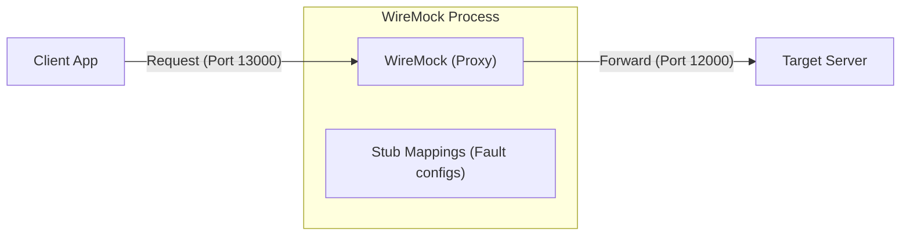

[English](README.md) | [Tiếng Việt](README.vi.md) | [日本語](README.ja.md)

# WireMockを使用したHTTPフォールトインジェクション

このプロジェクトは、**WireMock**を使用して、クライアントとサーバー間の通信に介入（エラーを注入）する方法を示すデモンストレーション例です。主な目的は、クライアントアプリケーションの耐障害性（フォールトトレランス）とエラー処理メカニズム（リトライロジックなど）を検証することです。

---

## シミュレーションアーキテクチャ

WireMockは、クライアントと実際のサーバーの間の**プロキシ層**として機能します。クライアントからサーバーに直接呼び出す代わりに、すべてのリクエストはWireMockを通過します。ここで、WireMockがエラーを返したり、応答を遅延させたり、データ内容を定期的に変更したりするように構成できます。

---

## サンプルシナリオ

[`tests/`](./tests)ディレクトリには、WireMockの使用レベルを基本から応用まで案内する4つの例があります。

1.  **[01_ClientAccessDirectToServer](./tests/01_ClientAccessDirectToServer/README.ja.md)**: クライアントとサーバー間の直接接続（プロキシなし）。これは、システムが正常に動作することを確認するための基本テストです。
2.  **[02_WireMockWithoutControl](./tests/02_WireMockWithoutControl/README.ja.md)**: WireMockを「透過的」プロキシ（Transparent Proxy）として導入し、エラーを注入せずにすべてのリクエストを転送します。
3.  **[03_WireMockWithControl](./tests/03_WireMockWithControl/README.ja.md)**: WireMockの**シナリオ（ステートマシン）**機能を使用して、制御された障害を注入します。
    *   最初の呼び出しでHTTP 500エラーを注入し、再試行で成功させます。
    *   ビジネスロジックエラーを注入します（HTTPコードが200であってもエラー内容を返します）。
    *   タイムアウトエラーを注入します（応答を遅延させてクライアントを切断させます）。
4.  **[04_TwoServers](./tests/04_TwoServers/README.ja.md)**: 2つのWireMockインスタンスがリクエストを2つの異なるサーバーにルーティングする、より複雑なシナリオです。マイクロサービス環境をシミュレートします。

---

## 環境とセットアップ

### 1. 動作環境
*   **オペレーティングシステム**: Windows。
*   **ツール**: **WireMock.Net**を使用します（dotnet toolを介して実行されるスタンドアロンバージョン）。

### 2. インストールと使用方法
.NET SDKのインストール方法、`dotnet-wiremock`ツールのインストール方法、およびマッピングファイル（JSON）の構成方法の詳細は、[WireMockの使用方法](./wiremock/README.ja.md)に詳しく説明されています。

---

## 重要な注意事項

このリポジトリには、PowerShellで記述された**クライアント**および**サーバー**プログラムが含まれています。
*   これらは、WireMockの機能を**デモンストレーション**するために極めてシンプルに設計されています。
*   このリポジトリの焦点は、エラーテストのための**WireMockの構成方法**であり、前述のクライアント/サーバーアプリケーションの開発ではありません。

---
> [!TIP]
> 各シナリオを実行するための特定のPowerShellコマンドについては、各`tests`サブディレクトリの`README.md`ファイルを参照してください。
