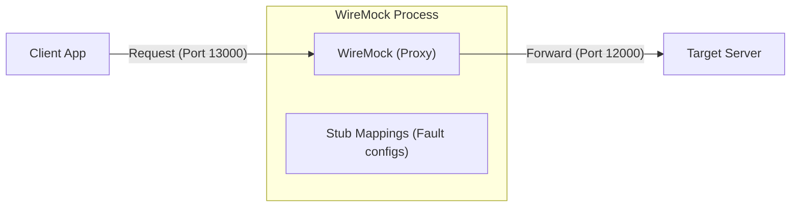

[English](README.md) | [Tiếng Việt](README.vi.md) | [日本語](README.ja.md)

# HTTP Fault Injection with WireMock

This project is a demonstration of using **WireMock** to intervene (inject errors) in the communication between a Client and a Server. The primary goal is to test fault tolerance and error handling mechanisms (e.g., retry logic) of the Client application.

---

## Simulated Architecture

WireMock acts as a **Proxy layer** between the Client and the real Server. Instead of calling the Server directly, all requests from the Client pass through WireMock. Here, we can configure WireMock to return errors, delay responses, or modify data content periodically.

---

## Example Scenarios

In the [`tests/`](./tests) directory, you will find 4 examples guiding you through different levels of using WireMock from basic to advanced:

1.  **[01_ClientAccessDirectToServer](./tests/01_ClientAccessDirectToServer)**: Direct connection between Client and Server (no Proxy). This is a baseline test to ensure the system functions normally.
2.  **[02_WireMockWithoutControl](./tests/02_WireMockWithoutControl)**: Introduces WireMock as a "transparent" Proxy, forwarding all requests without injecting errors.
3.  **[03_WireMockWithControl](./tests/03_WireMockWithControl)**: Uses WireMock's **Scenarios (State Machine)** feature to inject controlled failures:
    *   Injects an HTTP 500 error on the first call and succeeds on the retry.
    *   Injects a business logic error (returning error content even if the HTTP code is 200).
    *   Injects a Timeout error (delaying the response to force the Client to disconnect).
4.  **[04_TwoServers](./tests/04_TwoServers)**: A more complex scenario with 2 WireMock instances routing requests to 2 different Servers, simulating a Microservices environment.

---

## Environment and Setup

### 1. Operating Environment
*   **Operating System**: Windows.
*   **Tools**: Uses **WireMock.Net** (Standalone version running via dotnet tool).

### 2. Installation and Usage
Details on how to install the .NET SDK, install the `dotnet-wiremock` tool, and configure mapping files (JSON) are fully described in [Using WireMock](./wiremock/README.md).

---

## Important Notes

This repository includes **Client** and **Server** programs written in PowerShell:
*   They are designed to be extremely simple for **demonstration** purposes of WireMock's functionality.
*   The focus of this repository is the **method of configuring WireMock** for fault testing, not the development of the aforementioned Client/Server applications.

---
> [!TIP]
> You can refer to the `README.md` file in each `tests` subdirectory for specific PowerShell commands to run for each scenario.
