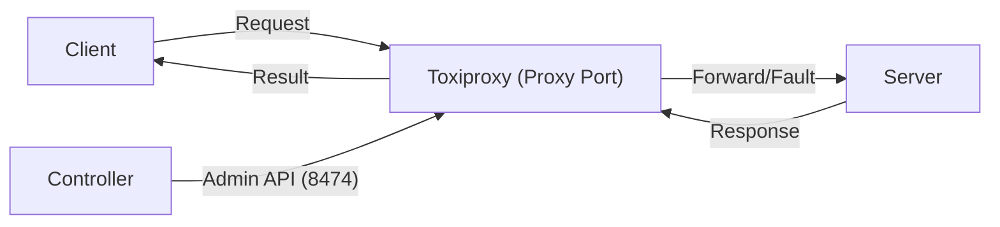

# 🧪 Usage Toxiproxy Example

Dự án này cung cấp một bộ công cụ mẫu để minh họa cách sử dụng [Toxiproxy](https://github.com/Shopify/toxiproxy) trong việc mô phỏng các lỗi mạng và kiểm thử (System Test) khả năng chịu lỗi (fault tolerance) cũng như cơ chế retry của Client.

---

## 🏗️ Kiến trúc hệ thống

Hệ thống mô phỏng một luồng API tiêu chuẩn đi qua Proxy để gây lỗi có kiểm soát:



| Thành phần | Thư mục | Mô tả |
| :--- | :--- | :--- |
| **Client** | [`/client`](./client/README.md) | Chương trình gửi HTTP request theo kịch bản định trước. |
| **Server** | [`/server`](./server/README.md) | HTTP server giả lập, phản hồi kết quả tùy chỉnh theo request. |
| **Controller** | [`/controller`](./controller/README.md) | "Bộ não" điều khiển Toxiproxy để tạo ra lỗi (latency, timeout, v.v.). |

---

## 🚀 Hướng dẫn nhanh (Quick Start)

### 1. Chuẩn bị
* Cài đặt và chạy **Toxiproxy Server** (Mặc định lắng nghe ở cổng `8474`).
* Mở 3 cửa sổ PowerShell riêng biệt cho 3 thành phần.

### 2. Khởi chạy các thành phần

#### Bước 1: Chạy Server
Cổng mặc định: `2000`
```powershell
cd server
.\program.ps1
```

#### Bước 2: Chạy Controller
Cấu hình proxy và kịch bản lỗi:
```powershell
cd controller
.\program.ps1 -ProxyName "my_api_proxy"
```

#### Bước 3: Chạy Client
Gửi request dựa trên các URL đầy đủ trong kịch bản:
```powershell
cd client
.\program.ps1
```

---

## 📄 Kịch bản (Scenarios)

Mỗi thành phần hoạt động dựa trên một file `scenario.csv` nằm trong thư mục tương ứng. Bạn có thể thay đổi cách hệ thống phản ứng bằng cách chỉnh sửa các file này mà không cần sửa code.

*   **Server Scenario**: Định nghĩa cặp `Method + Path` tương ứng với `Response`.
*   **Controller Scenario**: Định nghĩa hành vi của Proxy cho mỗi request (Pass, Timeout, Error Code...).
*   **Client Scenario**: Danh sách các request cần thực hiện.

---

## 🛠️ Yêu cầu hệ thống
- **Hệ điều hành**: Windows (PowerShell 5.1+ hoặc PowerShell Core).
- **Công cụ**: [Toxiproxy Binary](https://github.com/Shopify/toxiproxy/releases).
- **Quyền hạn**: Quyền User bình thường (Nếu dùng cổng > 1024).

> [!TIP]
> Để xem chi tiết cấu hình và các tham số kỹ thuật của từng phần, vui lòng truy cập vào `README.md` trong từng thư mục tương ứng.
