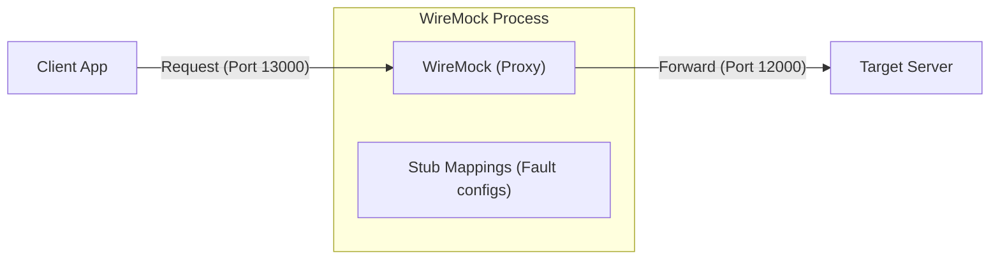

[English](README.md) | [Tiếng Việt](README.vi.md) | [日本語](README.ja.md)

# HTTP Fault Injection với WireMock

Dự án này là một ví dụ trình diễn cách sử dụng **WireMock** để can thiệp (gây lỗi) vào quá trình giao tiếp giữa Client và Server. Mục tiêu chính là để kiểm nghiệm khả năng chịu lỗi (fault tolerance) và các cơ chế xử lý lỗi (ví dụ: retry logic) của ứng dụng Client.

---

## Kiến trúc mô phỏng

WireMock đóng vai trò là một **Proxy layer** nằm giữa Client và Server thật. Thay vì gọi trực tiếp đến Server, mọi yêu cầu từ Client sẽ đi qua WireMock. Tại đây, chúng ta có thể cấu hình để WireMock trả về lỗi, làm chậm phản hồi hoặc thay đổi nội dung dữ liệu định kỳ.

---

## Các kịch bản ví dụ (Examples)

Trong thư mục [`tests/`](./tests), bạn sẽ tìm thấy 4 ví dụ hướng dẫn các cấp độ sử dụng WireMock từ cơ bản đến nâng cao:

1.  **[01_ClientAccessDirectToServer](./tests/01_ClientAccessDirectToServer/README.vi.md)**: Kết nối trực tiếp giữa Client và Server (không qua Proxy). Đây là bước kiểm tra cơ bản để đảm bảo hệ thống hoạt động bình thường.
2.  **[02_WireMockWithoutControl](./tests/02_WireMockWithoutControl/README.vi.md)**: Đưa WireMock vào làm Proxy trung gian kiểu "trong suốt" (Transparent Proxy), chuyển tiếp toàn bộ request mà không gây lỗi.
3.  **[03_WireMockWithControl](./tests/03_WireMockWithControl/README.vi.md)**: Sử dụng tính năng **Scenarios (State Machine)** của WireMock để gây lỗi có kiểm soát:
    *   Gây lỗi HTTP 500 ở lần gọi đầu tiên và thành công ở lần gọi lại.
    *   Gây lỗi logic nghiệp vụ (trả về nội dung lỗi dù HTTP code là 200).
    *   Gây lỗi Timeout (trì hoãn phản hồi để buộc Client phải ngắt kết nối).
4.  **[04_TwoServers](./tests/04_TwoServers/README.vi.md)**: Kịch bản phức tạp hơn với 2 bộ WireMock điều hướng request đến 2 Server khác nhau, mô phỏng môi trường Microservices.

---

## Môi trường và Cài đặt

### 1. Môi trường hoạt động
*   **Hệ điều hành**: Windows.
*   **Công cụ**: Sử dụng **WireMock.Net** (phiên bản Standalone chạy qua dotnet tool).

### 2. Cài đặt và Cách dùng
Chi tiết cách cài đặt .NET SDK, cài đặt công cụ `dotnet-wiremock` và cách cấu hình các file mapping (JSON) được mô tả đầy đủ tại [Hướng dẫn sử dụng WireMock](./wiremock/README.vi.md)

---

## Lưu ý quan trọng

Trong repository này có bao gồm các chương trình **Client** và **Server** viết bằng PowerShell:
*   Chúng được thiết kế cực kỳ đơn giản nhằm mục đích **minh họa** cách thức WireMock hoạt động.
*   Trọng tâm của repository này là **phương pháp cấu hình WireMock** để kiểm thử lỗi, không phải là phát triển các ứng dụng Client/Server nói trên.

---
> [!TIP]
> Bạn có thể tham khảo file `README.md` trong từng thư mục `tests` để biết các lệnh PowerShell cụ thể cần chạy cho từng kịch bản.
