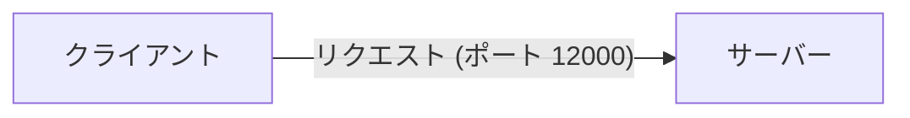
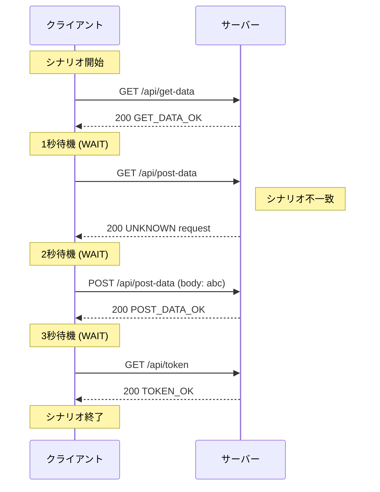

[English](README.md) | [Tiếng Việt](README.vi.md) | [日本語](README.ja.md)

# クライアントのサーバーへの直接アクセス

## 概要 (Overview)

この例では、WireMockを使用せずにクライアントがサーバーに直接アクセスするように設定し、クライアントとサーバーツールの基本的な使用方法をデモンストレーションします。



## テスト手順 (Test action)

* **サーバーの起動**
   `tests\ClientAccessDirectToServer` フォルダに移動し、以下を実行します：
   ```powershell
   ..\..\server\server.ps1 .\scenario-server.csv http://localhost:12000 3
   ```
* **クライアントの起動**
   `tests\ClientAccessDirectToServer` フォルダに移動し、以下を実行します：
   ```powershell
   ..\..\client\client.ps1 .\scenario-client.csv
   ```
* **サーバーの停止**
   すべてのクライアントリクエストが送信された後、サーバープロセスのターミナルで **Ctrl+C** を押して停止します。

## リクエストフローの説明 (Describe request flow)

以下に、シナリオと実出力ログに基づくリクエストの実行シーケンスを示します：


