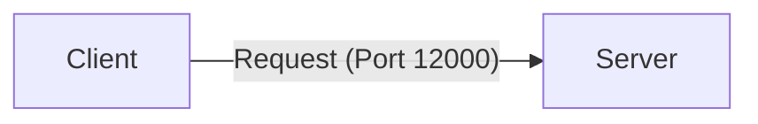
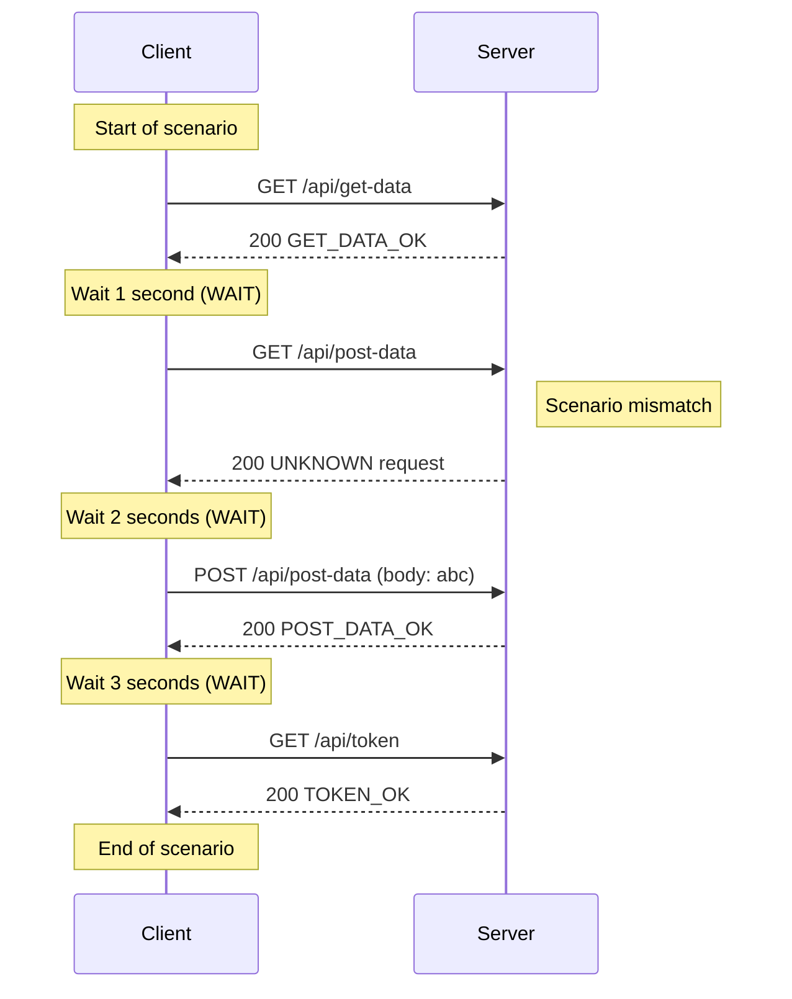

[English](README.md) | [Tiếng Việt](README.vi.md) | [日本語](README.ja.md)

# Client access direct to server

## Overview

In this example, we make the client access directly to the server without using Toxiproxy, just to demonstrate the basic usage of the client and server.



## Test action

* Start server
   Go to folder `tests\ClientAccessDirectToServer` then run
   ```powershell
   ..\..\server\server.ps1 .\scenario-server.csv http://localhost:12000 3
   ```
* Start client
   Go to folder `tests\ClientAccessDirectToServer` then run
   ```powershell
   ..\..\client\client.ps1 .\scenario-client.csv
   ```
* After all client's requests sent, stop server
   Press Ctrl+C on server terminal to stop the server.

## Describe request flow

Following is the request sequence based on the scenario and actual results:


