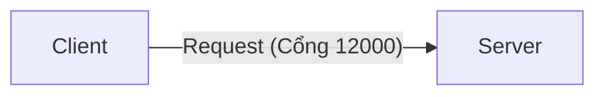
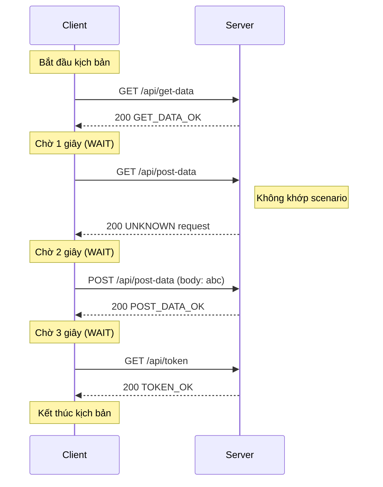

[English](README.md) | [Tiếng Việt](README.vi.md) | [日本語](README.ja.md)

# Client truy cập trực tiếp server

## Tổng quan (Overview)

Trong ví dụ này, chúng ta giả lập việc client truy cập trực tiếp vào server mà không thông qua WireMock, nhằm minh họa cách sử dụng cơ bản của bộ công cụ client và server.



## Các bước thực hiện (Test action)

* **Khởi chạy server**
   Chuyển đến thư mục `tests\ClientAccessDirectToServer` sau đó chạy lệnh:
   ```powershell
   ..\..\server\server.ps1 .\scenario-server.csv http://localhost:12000 3
   ```
* **Khởi chạy client**
   Chuyển đến thư mục `tests\ClientAccessDirectToServer` sau đó chạy lệnh:
   ```powershell
   ..\..\client\client.ps1 .\scenario-client.csv
   ```
* **Dừng server**
   Sau khi tất cả các request của client đã gửi xong, nhấn **Ctrl+C** trên terminal của server để dừng.

## Mô tả luồng request (Describe request flow)

Dưới đây là trình tự thực hiện các request dựa trên kịch bản và kết quả thực tế thu được:


