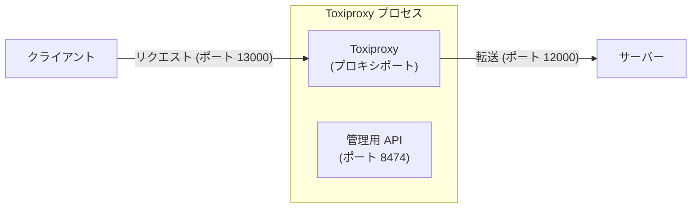
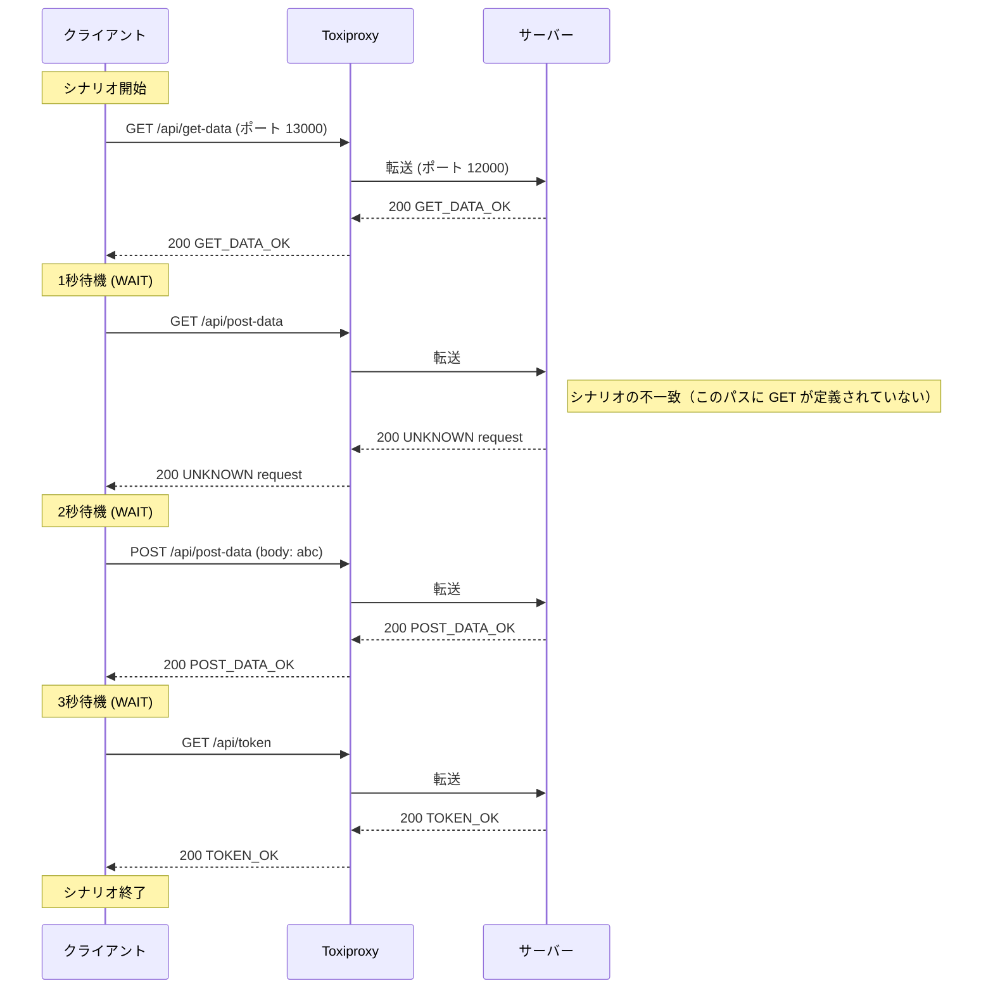

[English](README.md) | [Tiếng Việt](README.vi.md) | [日本語](README.ja.md)

# Toxiproxy経由でのサーバーへのクライアントアクセス（コントローラーなし）

## 概要

このテストでは、クライアントはToxiproxyを介してサーバーに接続しますが、変更（遅延、エラーなど）は適用されません。これは、Toxiproxyのデフォルトのパススルー動作を示しています。



## テスト手順

* **サーバーの起動**
   `tests\02_ToxiProxyWithoutController` フォルダに移動し、以下を実行します：
   ```powershell
   ..\..\server\server.ps1 .\scenario-server.csv http://localhost:12000 3
   ```
* **ToxiProxy の起動**
   `tests\02_ToxiProxyWithoutController` フォルダに移動し、以下を実行します：
   ```powershell
    ..\..\toxiproxy\toxiproxy-server-windows-amd64.exe -config ..\..\toxiproxy\server1-config.json
   ```
* **クライアントの起動**
   `tests\02_ToxiProxyWithoutController` フォルダに移動し、以下を実行します：
   ```powershell
   ..\..\client\client.ps1 .\scenario-client.csv
   ```
* **サーバーの停止**
   すべてのクライアントリクエストが送信された後、サーバーのターミナルで **Ctrl+C** を押して停止します。

## リクエストフローの説明

以下は、`output.md` ログとシナリオファイルによって確認されたリクエストシーケンスです。エラーは挿入されていませんが、リクエストはポート 13000 にある Toxiproxy の「ミラー」を介して渡されます。


