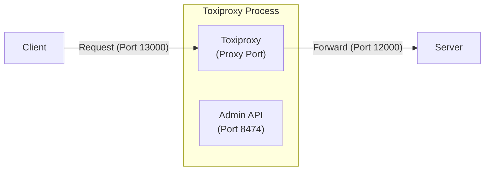
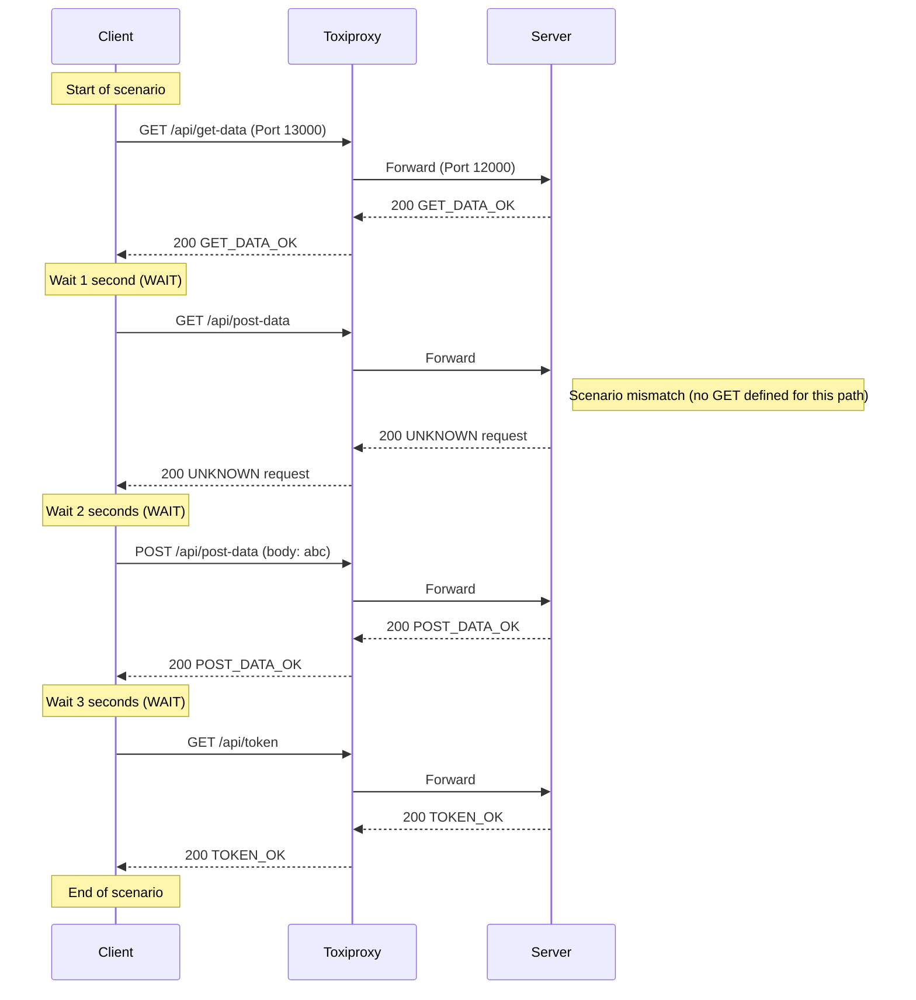

# Client access server via Toxiproxy (No Controller)

## Overview

In this test, the client connects to the server through Toxiproxy, but no modifications (latency, errors) are applied. This demonstrates Toxiproxy's default pass-through behavior.



## Test action

* **Start server**
   Go to the `tests\02_ToxiProxyWithoutController` folder and run:
   ```powershell
   ..\..\server\server.ps1 .\scenario-server.csv http://localhost:12000 3
   ```
* **Start ToxiProxy**
   Run the Toxiproxy server with the predefined configuration:
   ```powershell
    ..\..\toxiproxi\toxiproxy-server-windows-amd64.exe -config ..\..\toxiproxi\server1-config.json
   ```
* **Start client**
   Run the client scenario (pointing to the Toxiproxy port `13000`):
   ```powershell
   ..\..\client\client.ps1 .\scenario-client.csv
   ```
* **Stop server**
   After all client requests are sent, press **Ctrl+C** on the server terminal to stop.

## Describe request flow

Following is the request sequence verified by the `output.md` logs and scenario files. Even though no errors are injected, the requests pass through Toxiproxy's "mirror" on port 13000.


