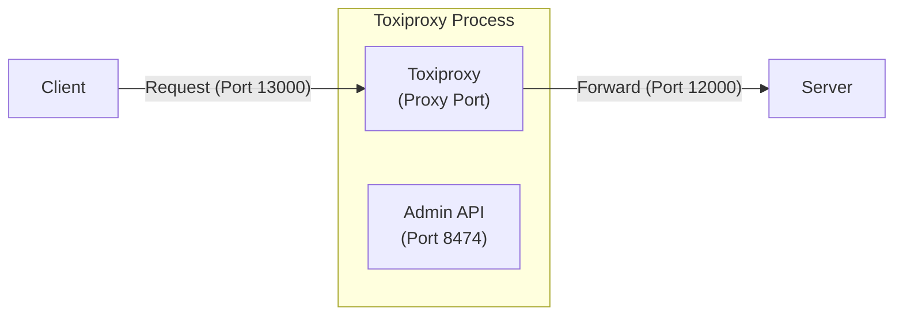
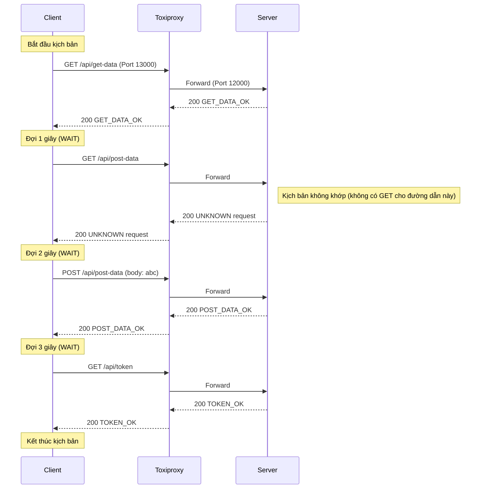

[English](README.md) | [Tiếng Việt](README.vi.md) | [日本語](README.ja.md)

# Truy cập server qua Toxiproxy (Không có Controller)

## Tổng quan

Trong bài kiểm tra này, client kết nối với server thông qua Toxiproxy, nhưng không có thay đổi nào (độ trễ, lỗi) được áp dụng. Điều này minh họa hành vi chuyển tiếp mặc định của Toxiproxy.



## Các bước kiểm tra

* **Khởi động server**
   Truy cập vào thư mục `tests\02_ToxiProxyWithoutController` và chạy:
   ```powershell
   ..\..\server\server.ps1 .\scenario-server.csv http://localhost:12000 3
   ```
* **Khởi động ToxiProxy**
   Chạy Toxiproxy server với cấu hình đã định nghĩa trước:
   ```powershell
    ..\..\toxiproxy\toxiproxy-server-windows-amd64.exe -config ..\..\toxiproxy\server1-config.json
   ```
* **Khởi động client**
   Chạy kịch bản client (trỏ đến cổng Toxiproxy `13000`):
   ```powershell
   ..\..\client\client.ps1 .\scenario-client.csv
   ```
* **Dừng server**
   Sau khi tất cả các yêu cầu từ client đã được gửi, nhấn **Ctrl+C** trên terminal của server để dừng.

## Mô tả luồng yêu cầu

Dưới đây là trình tự yêu cầu được xác nhận bởi nhật ký `output.md` và các tệp kịch bản. Ngay cả khi không có lỗi nào được đưa vào, các yêu cầu vẫn đi qua "cổng phản chiếu" của Toxiproxy trên cổng 13000.


