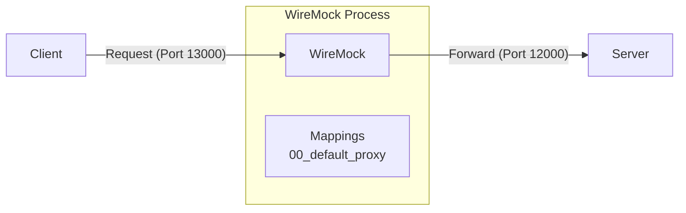
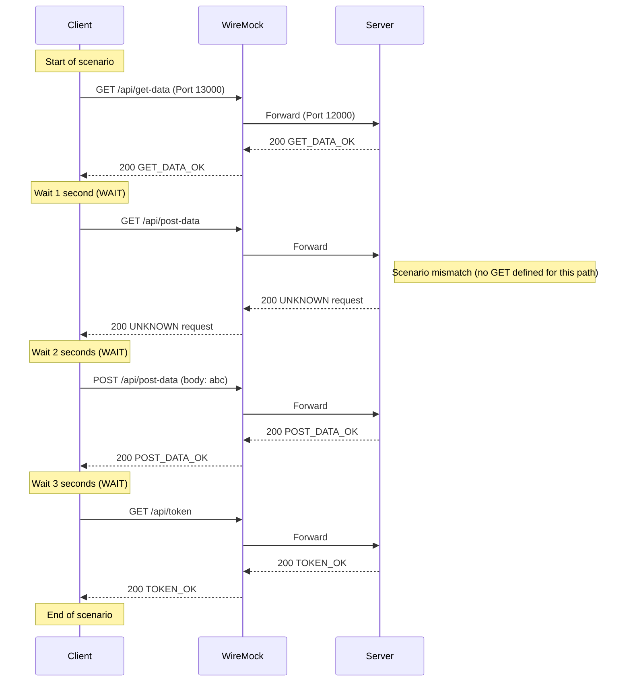

[English](README.md) | [Tiếng Việt](README.vi.md) | [日本語](README.ja.md)

# Client access server via WireMock (No Controller)

## Overview

In this test, the client connects to the server through WireMock acting as a transparent proxy, but no modifications (latency, errors) are applied. This demonstrates WireMock's default pass-through behavior.



## Test action

* **Start WireMock**
   Go to the `tests\02_WireMockWithoutControl` folder and run:
   ```powershell
   dotnet-wiremock --urls "http://localhost:13000" --ReadStaticMappings true --WireMockLogger WireMockConsoleLogger
   ```
* **Start server**
   Go to the `tests\02_WireMockWithoutControl` folder and run:
   ```powershell
   ..\..\server\server.ps1 .\scenario-server.csv http://localhost:12000 3
   ```
* **Start client**
   Go to the `tests\02_WireMockWithoutControl` folder and run:
   ```powershell
   ..\..\client\client.ps1 .\scenario-client.csv
   ```
* **Stop server**
   After all client requests are sent, press **Ctrl+C** on the server terminal to stop.

## Describe request flow

Following is the request sequence verified by the `output.md` logs and scenario files. Even though no errors are injected, the requests pass through WireMock's transparent proxy on port 13000.


