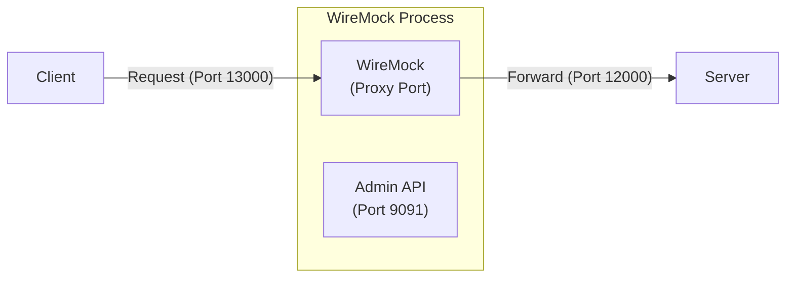
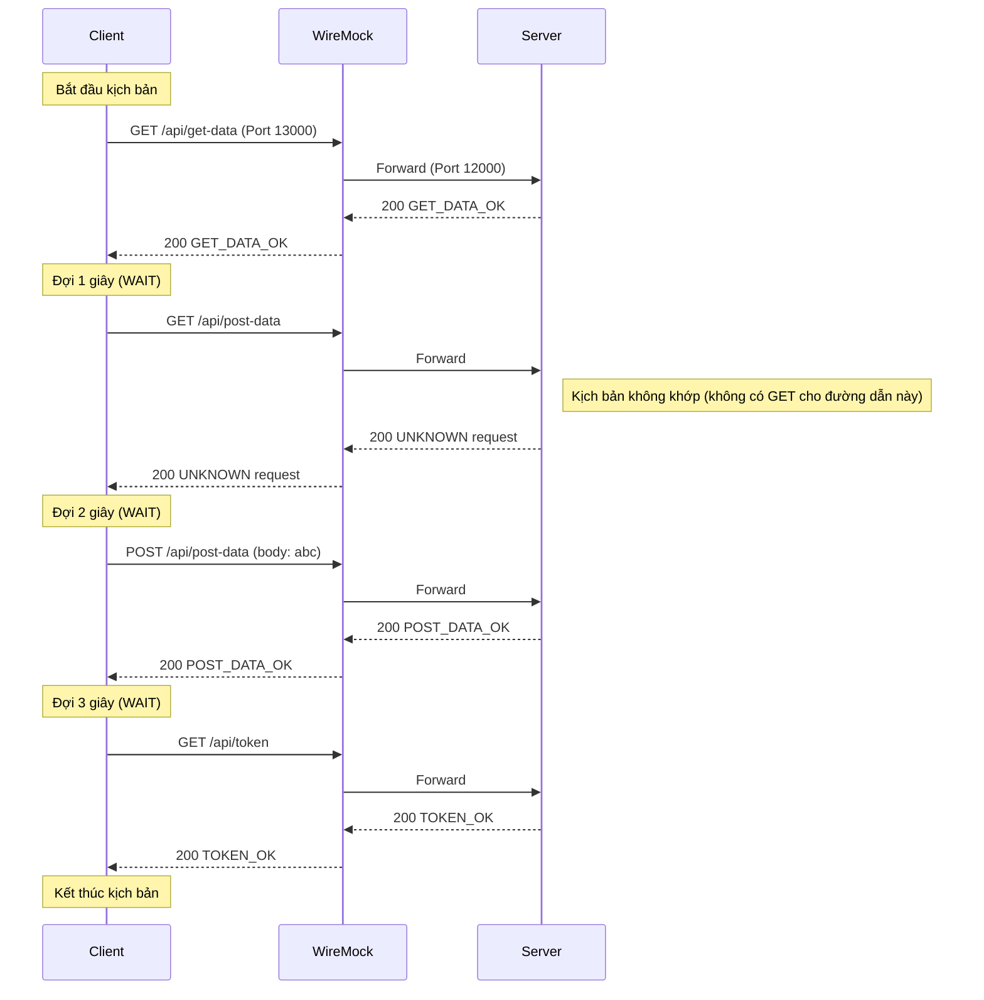

[English](README.md) | [Tiếng Việt](README.vi.md) | [日本語](README.ja.md)

# Truy cập server qua WireMock (Không có Controller)

## Tổng quan

Trong bài kiểm tra này, client kết nối với server thông qua WireMock hoạt động như một proxy trong suốt, nhưng không có thay đổi nào (độ trễ, lỗi) được áp dụng. Điều này minh họa hành vi chuyển tiếp mặc định của WireMock.



## Các bước kiểm tra

* **Khởi động WireMock**
   Truy cập vào thư mục `tests\02_WireMockWithoutControl` và chạy:
   ```powershell
   dotnet-wiremock --urls "http://localhost:13000" --ReadStaticMappings true --WireMockLogger WireMockConsoleLogger
   ```
* **Khởi động server**
   Truy cập vào thư mục `tests\02_WireMockWithoutControl` và chạy:
   ```powershell
   ..\..\server\server.ps1 .\scenario-server.csv http://localhost:12000 3
   ```
* **Khởi động client**
   Truy cập vào thư mục `tests\02_WireMockWithoutControl` và chạy:
   ```powershell
   ..\..\client\client.ps1 .\scenario-client.csv
   ```
* **Dừng server**
   Sau khi tất cả các yêu cầu từ client đã được gửi, nhấn **Ctrl+C** trên terminal của server để dừng.

## Mô tả luồng yêu cầu

Dưới đây là trình tự yêu cầu được xác nhận bởi nhật ký `output.md` và các tệp kịch bản. Ngay cả khi không có lỗi nào được đưa vào, các yêu cầu vẫn đi qua proxy trong suốt của WireMock trên cổng 13000.


