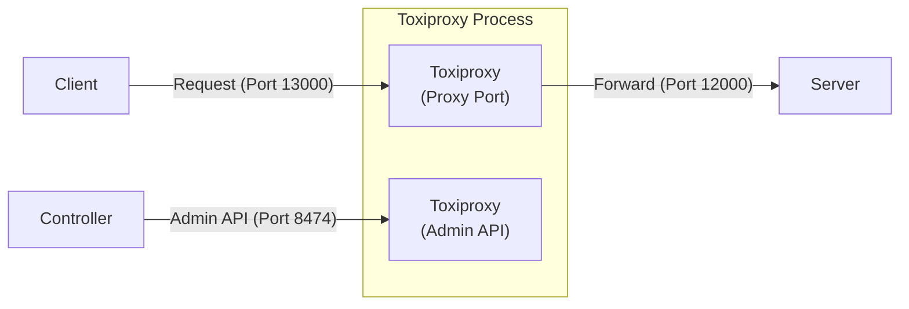

# Client access server via Toxiproxy

## Overview

Mô tả luồng kết nối giữa các thành phần trong bài test này:



## Test action

* **Start server**
  Go to the `tests\03_ToxyProxyWithController` folder and run:
  ```powershell
  ..\..\server\server.ps1 .\scenario-server.csv http://localhost:12000 3
  ```
* **Start ToxiProxy**
  Go to the `tests\03_ToxyProxyWithController` folder and run:
  ```powershell
  ..\..\toxiproxy\toxiproxy-server-windows-amd64.exe -config ..\..\toxiproxy\server1-config.json
  ```
* **Start ToxiProxy controller**
  Go to the `tests\03_ToxyProxyWithController` folder and run:
  ```powershell
  ..\..\controller\controller.ps1 .\scenario-controller.csv
  ```
* **Start client**
  Go to the `tests\03_ToxyProxyWithController` folder and run:
  ```powershell
  ..\..\client\client.ps1 .\scenario-client.csv
  ```
* **Stop server**
  After all client requests are sent, press **Ctrl+C** on the server terminal to stop.

## Describe request flow
