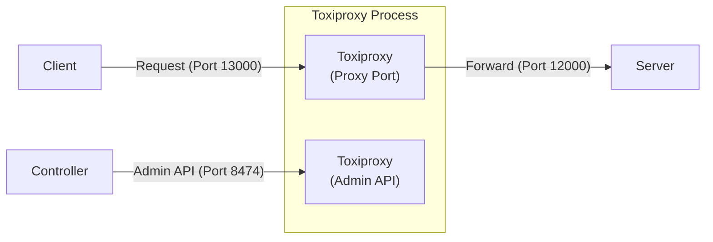

# Client access server via Toxiproxy

## Overview

Mô tả luồng kết nối giữa các thành phần trong bài test này:



## Test action

Thực hiện các bước sau trong thư mục `tests\ClientAccessServerViaToxi`:


### Start server

```powershell
..\..\server\server.ps1 .\scenario-server.csv http://localhost:12000 3
```

### Start ToxiProxy

```powershell
..\..\toxiproxy\toxiproxy-windows-amd64.exe -config toxiproxy-config.json
```

### Start client

```powershell
..\..\client\client.ps1 .\scenario-client.csv
```

### Stop server

Press Ctrl+C on server terminal to stop the server.
