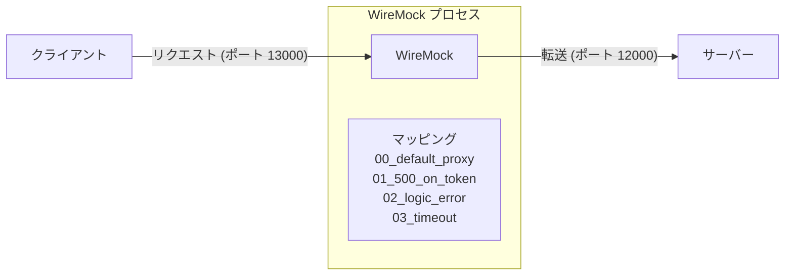
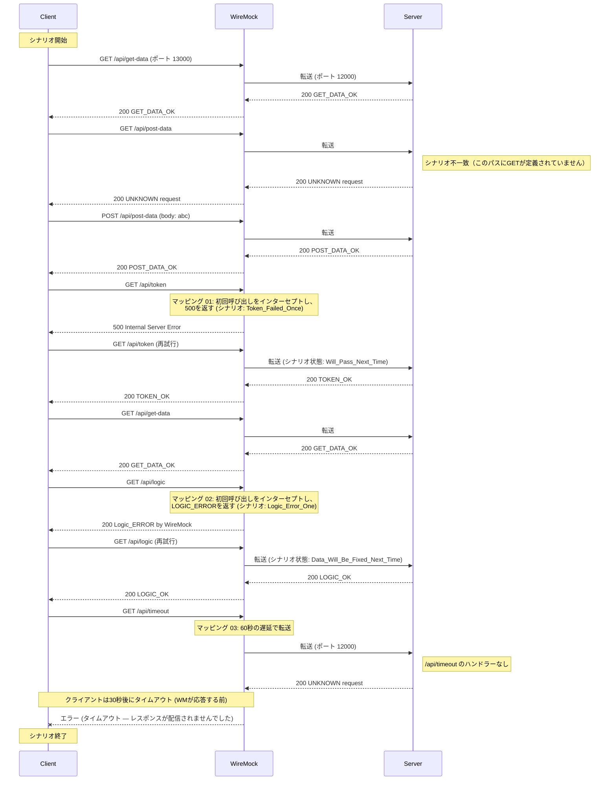

[English](README.md) | [Tiếng Việt](README.vi.md) | [日本語](README.ja.md)

# Toxiproxy経由でのサーバーへのクライアントアクセス

## 概要

このテストでは、クライアントはWireMockを介してサーバーに接続し、変更（遅延、エラー）が適用されます。
* /api/tokenの初回呼び出し時にエラーを発生させ、HTTP 500を返します。
* /api/logicの初回呼び出し時にロジックエラーを発生させ、HTTP 200を返しますが、レスポンスボディでクライアントにエラーが発生したことを示します。
* タイムアウトエラーを発生させます。



## テスト手順

* **WireMockの起動**
  `tests\03_WireMockWithControl` フォルダに移動して実行します：
  ```powershell
   dotnet-wiremock --urls "http://localhost:13000" --ReadStaticMappings true --WireMockLogger WireMockConsoleLogger
  ```
* **サーバーの起動**
  `tests\03_WireMockWithControl` フォルダに移動して実行します：
  ```powershell
  ..\..\server\server.ps1 .\scenario-server.csv http://localhost:12000 3
  ```
* **クライアントの起動**
  `tests\03_WireMockWithControl` フォルダに移動して実行します：
  ```powershell
  ..\..\client\client.ps1 .\scenario-client.csv
  ```
* **サーバーの停止**
  すべてのクライアントリクエストが送信された後、サーバーのターミナルで **Ctrl+C** を押して停止します。

## リクエストフローの説明

以下は、`output.md` ログとシナリオファイルによって検証されたリクエストシーケンスです。WireMockは特定のルートをインターセプトしてエラーをシミュレートし、それ以外を透過的にサーバーに転送します。


