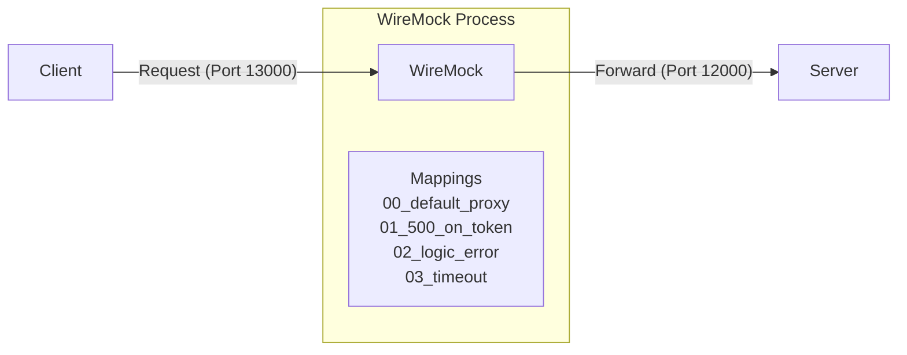
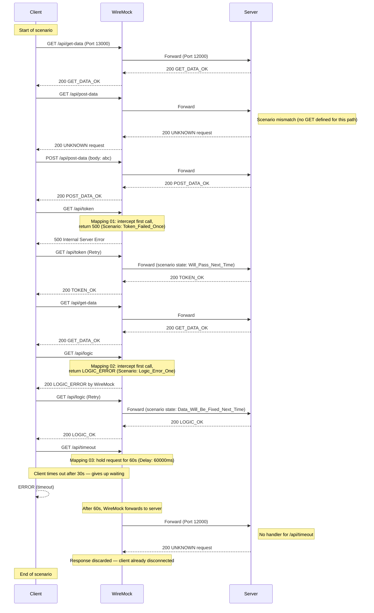

[English](README.md) | [Tiếng Việt](README.vi.md) | [日本語](README.ja.md)

# Client access server via WireMock

## Overview

In this test, the client connects to the server through WireMock, and modifications (latency, errors) are applied.
* It causes error for the first time call of /api/token, return HTTP 500.
* It causes logic error for the first call of /api/logic, return HTTP 200 but the response body show to the client that error occured.
* It causes timeout error.



## Test action

* **Start WireMock**
  Go to the `tests\03_WireMockWithControl` folder and run:
  ```powershell
   dotnet-wiremock --urls "http://localhost:13000" --ReadStaticMappings true --WireMockLogger WireMockConsoleLogger
  ```
* **Start server**
  Go to the `tests\03_WireMockWithControl` folder and run:
  ```powershell
  ..\..\server\server.ps1 .\scenario-server.csv http://localhost:12000 3
  ```
* **Start client**
  Go to the `tests\03_WireMockWithControl` folder and run:
  ```powershell
  ..\..\client\client.ps1 .\scenario-client.csv
  ```
* **Stop server**
  After all client requests are sent, press **Ctrl+C** on the server terminal to stop.

## Describe request flow

Following is the request sequence verified by the `output.md` logs and scenario files. WireMock intercepts specific routes to simulate errors before forwarding others transparently to the server.


