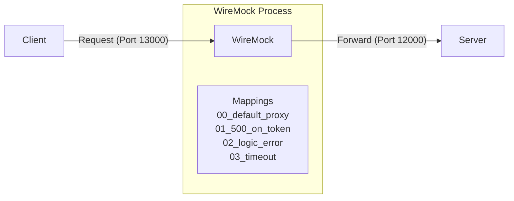
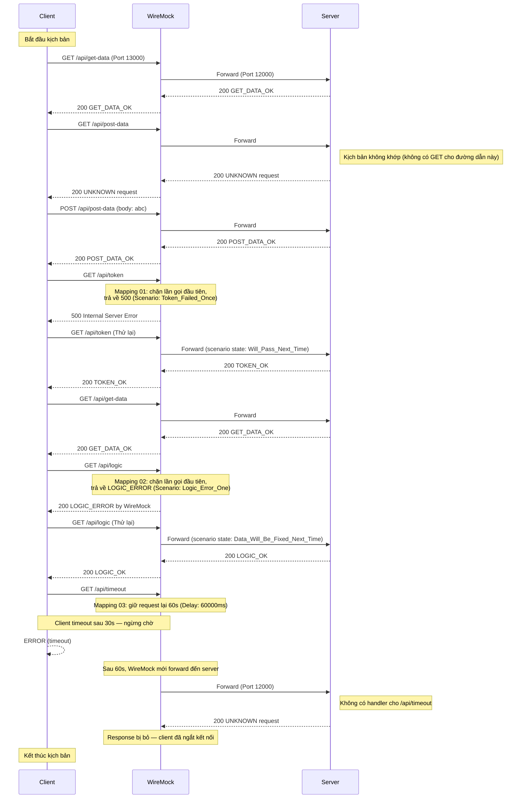

[English](README.md) | [Tiếng Việt](README.vi.md) | [日本語](README.ja.md)

# Client truy cập server qua WireMock (Có Controller)

## Tổng quan

Trong bài kiểm tra này, client kết nối với server thông qua WireMock, và các thay đổi (độ trễ, lỗi) được áp dụng.
* Gây lỗi cho lần gọi đầu tiên của /api/token, trả về HTTP 500.
* Gây lỗi logic cho lần gọi đầu tiên của /api/logic, trả về HTTP 200 nhưng nội dung phản hồi cho client biết đã xảy ra lỗi.
* Gây lỗi timeout.



## Các bước kiểm tra

* **Khởi động WireMock**
  Truy cập vào thư mục `tests\03_WireMockWithControl` và chạy:
  ```powershell
   dotnet-wiremock --urls "http://localhost:13000" --ReadStaticMappings true --WireMockLogger WireMockConsoleLogger
  ```
* **Khởi động server**
  Truy cập vào thư mục `tests\03_WireMockWithControl` và chạy:
  ```powershell
  ..\..\server\server.ps1 .\scenario-server.csv http://localhost:12000 3
  ```
* **Khởi động client**
  Truy cập vào thư mục `tests\03_WireMockWithControl` và chạy:
  ```powershell
  ..\..\client\client.ps1 .\scenario-client.csv
  ```
* **Dừng server**
  Sau khi tất cả các yêu cầu từ client đã được gửi, nhấn **Ctrl+C** trên terminal của server để dừng.

## Mô tả luồng yêu cầu

Dưới đây là trình tự yêu cầu được xác nhận bởi nhật ký `output.md` và các tệp kịch bản. WireMock chặn các route cụ thể để mô phỏng lỗi, trong khi các route khác được chuyển tiếp trong suốt đến server.


