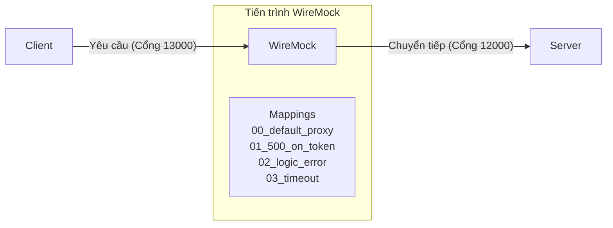
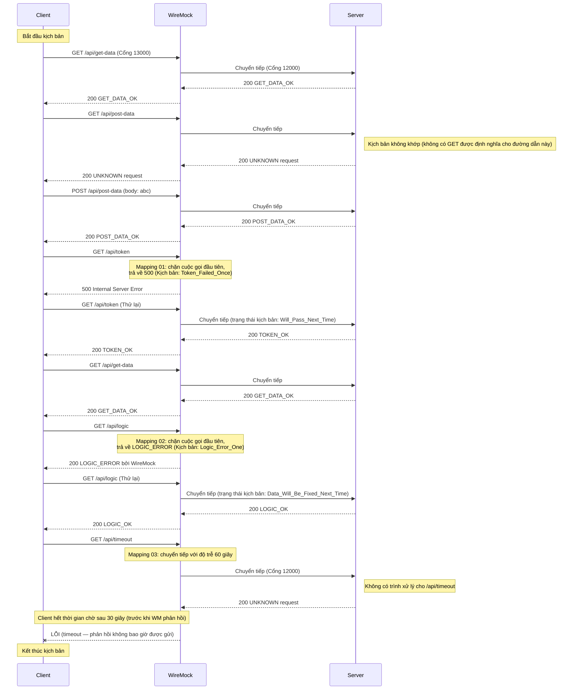

[English](README.md) | [Tiếng Việt](README.vi.md) | [日本語](README.ja.md)

# Client truy cập server thông qua Toxiproxy

## Tổng quan

Trong bài test này, client kết nối với server thông qua WireMock, và các sửa đổi (độ trễ, lỗi) được áp dụng.
* Nó gây ra lỗi cho lần gọi đầu tiên của /api/token, trả về HTTP 500.
* Nó gây ra lỗi logic cho lần gọi đầu tiên của /api/logic, trả về HTTP 200 nhưng thân phản hồi hiển thị cho client rằng lỗi đã xảy ra.
* Nó gây ra lỗi timeout.



## Hành động kiểm tra

* **Khởi chạy WireMock**
  Đi tới thư mục `tests\03_WireMockWithControl` và chạy:
  ```powershell
   dotnet-wiremock --urls "http://localhost:13000" --ReadStaticMappings true --WireMockLogger WireMockConsoleLogger
  ```
* **Khởi chạy server**
  Đi tới thư mục `tests\03_WireMockWithControl` và chạy:
  ```powershell
  ..\..\server\server.ps1 .\scenario-server.csv http://localhost:12000 3
  ```
* **Khởi chạy client**
  Đi tới thư mục `tests\03_WireMockWithControl` và chạy:
  ```powershell
  ..\..\client\client.ps1 .\scenario-client.csv
  ```
* **Dừng server**
  Sau khi tất cả các yêu cầu của client đã được gửi, nhấn **Ctrl+C** trên terminal của server để dừng.

## Mô tả luồng yêu cầu

Sau đây là trình tự yêu cầu được xác minh bởi các bản ghi `output.md` và các tệp kịch bản. WireMock chặn các định tuyến cụ thể để mô phỏng lỗi trước khi chuyển tiếp các yêu cầu khác một cách minh bạch đến server.


