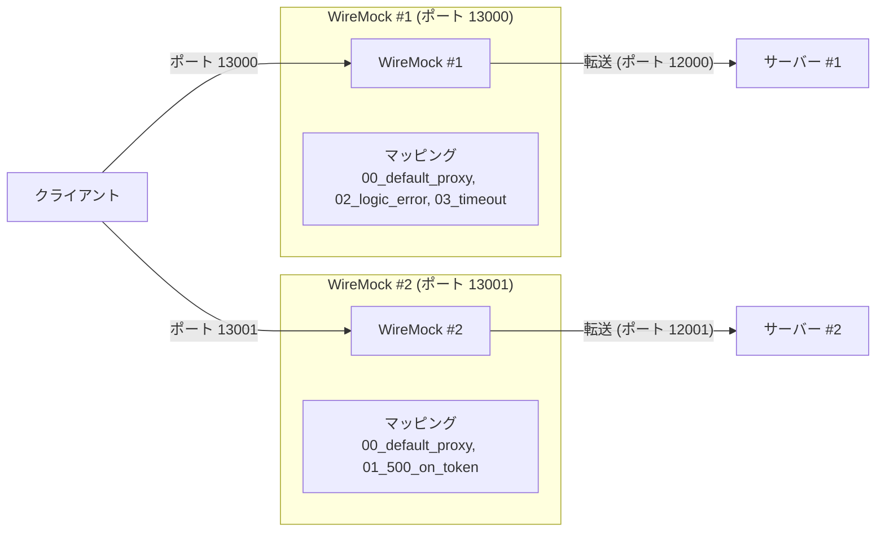

[English](README.md) | [Tiếng Việt](README.vi.md) | [日本語](README.ja.md)

# WireMock経由での2つのサーバーへのクライアントアクセス

## 概要

このテストでは、クライアントは、それぞれ異なるポートで実行されている **2つのWireMockインスタンス** を介して **2つの個別のサーバー** に接続します。ルーティングは目的別に分割されています：

* **ポート 13001** での `/api/token` および `/api/get-data` へのリクエストは **WireMock #2** によって処理され、**サーバー #2** (ポート 12001) に転送されます。
* **ポート 13000** でのその他のすべての `/api/*` リクエストは **WireMock #1** によって処理され、**サーバー #1** (ポート 12000) に転送されます。

適用されるエラーシミュレーション：
* `/api/token` (ポート 13001) への最初の呼び出しは HTTP 500 を返します。
* `/api/logic` (ポート 13000) への最初の呼び出しは、ロジックエラーボディを含む HTTP 200 を返します。
* `/api/timeout` (ポート 13000) への呼び出しは、クライアント側のタイムアウトを引き起こします。



## サーバーシナリオ

**サーバー #1** (`scenario-server.csv`) — 一般的な API ルートを処理：

| method | request        | response     |
| ------ | -------------- | ------------ |
| GET    | /api/get-data  | GET_DATA_OK  |
| POST   | /api/post-data | POST_DATA_OK |
| GET    | /api/logic     | LOGIC_OK     |

**サーバー #2** (`scenario-server-token.csv`) — トークンと get-data ルートを処理：

| method | request       | response    |
| ------ | ------------- | ----------- |
| GET    | /api/get-data | GET_DATA_OK |
| GET    | /api/token    | TOKEN_OK    |

## テスト手順

* **WireMock #1 の起動**
  `tests\04_TwoServers\wm1` フォルダに移動して実行します：
  ```powershell
  dotnet-wiremock --urls "http://localhost:13000" --ReadStaticMappings true --WireMockLogger WireMockConsoleLogger
  ```

* **WireMock #2 の起動**
  `tests\04_TwoServers\wm2` フォルダに移動して実行します：
  ```powershell
  dotnet-wiremock --urls "http://localhost:13001" --ReadStaticMappings true --WireMockLogger WireMockConsoleLogger
  ```

* **サーバー #1 の起動**
  `tests\04_TwoServers` フォルダに移動して実行します：
  ```powershell
  ..\..\server\server.ps1 .\scenario-server.csv http://localhost:12000 3
  ```

* **サーバー #2 の起動**
  `tests\04_TwoServers` フォルダに移動して実行します：
  ```powershell
  ..\..\server\server.ps1 .\scenario-server-token.csv http://localhost:12001 3
  ```

* **クライアントの起動**
  `tests\04_TwoServers` フォルダに移動して実行します：
  ```powershell
  ..\..\client\client.ps1 .\scenario-client.csv
  ```

* **サーバーの停止**
  すべてのクライアントリクエストが送信された後、両方のサーバーターミナルで **Ctrl+C** を押して停止します。

## リクエストフローの説明

```mermaid
sequenceDiagram
    participant Client
    participant WM2 as WireMock-2 #2 (13001)
    participant WM1 as WireMock-1 #1 (13000)
    participant S2 as サーバー-2 #2 (12001)
    participant S1 as サーバー-1 #1 (12000)

    Note over Client: シナリオ開始

    Client->>WM2: GET /api/get-data (ポート 13001)
    WM2->>S2: 転送 (ポート 12001)
    S2-->>WM2: 200 GET_DATA_OK
    WM2-->>Client: 200 GET_DATA_OK

    Client->>WM1: GET /api/post-data (ポート 13000)
    WM1->>S1: 転送 (ポート 12000)
    Note right of S1: シナリオ不一致（このパスにGETが定義されていません）
    S1-->>WM1: 200 UNKNOWN request
    WM1-->>Client: 200 UNKNOWN request

    Client->>WM1: POST /api/post-data (body: abc)
    WM1->>S1: 転送
    S1-->>WM1: 200 POST_DATA_OK
    WM1-->>Client: 200 POST_DATA_OK

    Client->>WM2: GET /api/token (ポート 13001)
    Note over WM2: マッピング 01: 初回呼び出しをインターセプトし、<br/>500を返す (シナリオ: Token_Failed_Once)
    WM2-->>Client: 500 Internal Server Error

    Client->>WM2: GET /api/token (再試行)
    WM2->>S2: 転送 (シナリオ状態: Will_Pass_Next_Time)
    S2-->>WM2: 200 TOKEN_OK
    WM2-->>Client: 200 TOKEN_OK

    Client->>WM1: GET /api/get-data (ポート 13000)
    WM1->>S1: 転送
    S1-->>WM1: 200 GET_DATA_OK
    WM1-->>Client: 200 GET_DATA_OK

    Client->>WM1: GET /api/logic (ポート 13000)
    Note over WM1: マッピング 02: 初回呼び出しをインターセプトし、<br/>LOGIC_ERRORを返す (シナリオ: Logic_Error_One)
    WM1-->>Client: 200 LOGIC_ERROR by WireMock

    Client->>WM1: GET /api/logic (再試行)
    WM1->>S1: 転送 (シナリオ状態: Data_Will_Be_Fixed_Next_Time)
    S1-->>WM1: 200 LOGIC_OK
    WM1-->>Client: 200 LOGIC_OK

    Client->>WM1: GET /api/timeout (ポート 13000)
    Note over WM1: マッピング 03: 60秒間リクエストを保持 (Delay: 60000ms)
    Note over Client,WM1: クライアントは30秒後にタイムアウト — 待機を断念
    Client-->>Client: エラー (タイムアウト)
    Note over WM1: 60秒後、WireMock #1 がサーバーに転送
    WM1->>S1: 転送 (ポート 12000)
    Note right of S1: /api/timeout のハンドラーなし
    S1-->>WM1: 200 UNKNOWN request
    Note over WM1: レスポンスは破棄されました — クライアントは既に切断されています
    
    Note over Client: シナリオ終了
```


