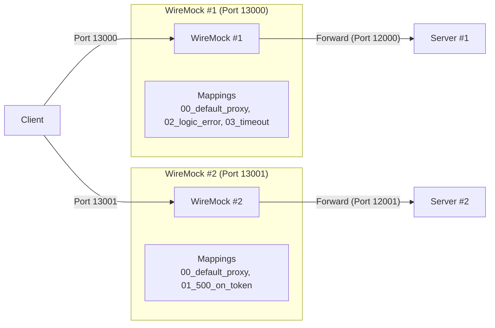
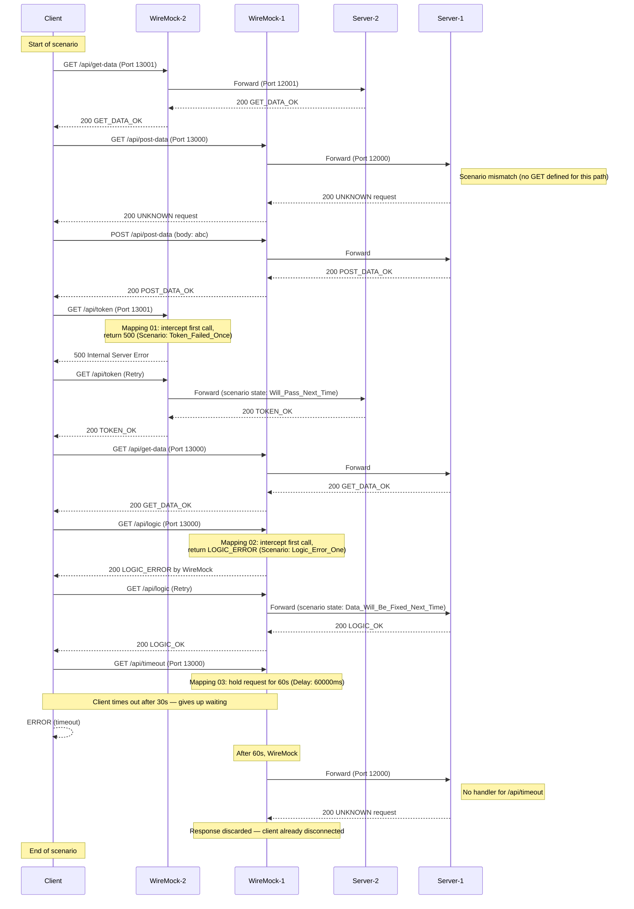

[English](README.md) | [Tiếng Việt](README.vi.md) | [日本語](README.ja.md)

# Client access two servers via WireMock

## Overview

In this test, the client connects to **two separate servers** through **two WireMock instances**, each running on a different port. The routing is split by purpose:

* Requests to `/api/token` and `/api/get-data` on **port 13001** are handled by **WireMock #2**, which forwards to **Server #2** (port 12001).
* All other `/api/*` requests on **port 13000** are handled by **WireMock #1**, which forwards to **Server #1** (port 12000).

Error simulations applied:
* First call to `/api/token` (port 13001) returns HTTP 500.
* First call to `/api/logic` (port 13000) returns HTTP 200 with a logic error body.
* Call to `/api/timeout` (port 13000) causes a client-side timeout.



## Server scenarios

**Server #1** (`scenario-server.csv`) — handles general API routes:

| method | request        | response     |
| ------ | -------------- | ------------ |
| GET    | /api/get-data  | GET_DATA_OK  |
| POST   | /api/post-data | POST_DATA_OK |
| GET    | /api/logic     | LOGIC_OK     |

**Server #2** (`scenario-server-token.csv`) — handles token and get-data routes:

| method | request       | response    |
| ------ | ------------- | ----------- |
| GET    | /api/get-data | GET_DATA_OK |
| GET    | /api/token    | TOKEN_OK    |

## Test action

* **Start WireMock #1**
  Go to the `tests\04_TwoServers\wm1` folder and run:
  ```powershell
  dotnet-wiremock --urls "http://localhost:13000" --ReadStaticMappings true --WireMockLogger WireMockConsoleLogger
  ```

* **Start WireMock #2**
  Go to the `tests\04_TwoServers\wm2` folder and run:
  ```powershell
  dotnet-wiremock --urls "http://localhost:13001" --ReadStaticMappings true --WireMockLogger WireMockConsoleLogger
  ```

* **Start Server #1**
  Go to the `tests\04_TwoServers` folder and run:
  ```powershell
  ..\..\server\server.ps1 .\scenario-server.csv http://localhost:12000 3
  ```

* **Start Server #2**
  Go to the `tests\04_TwoServers` folder and run:
  ```powershell
  ..\..\server\server.ps1 .\scenario-server-token.csv http://localhost:12001 3
  ```

* **Start client**
  Go to the `tests\04_TwoServers` folder and run:
  ```powershell
  ..\..\client\client.ps1 .\scenario-client.csv
  ```

* **Stop servers**
  After all client requests are sent, press **Ctrl+C** on both server terminals to stop.

## Describe request flow


