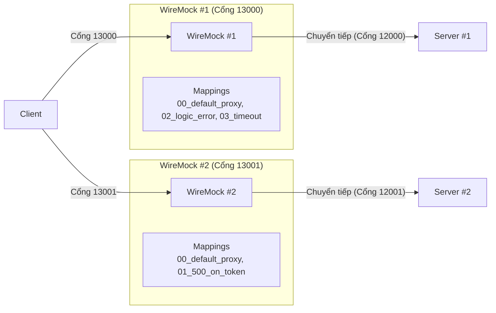
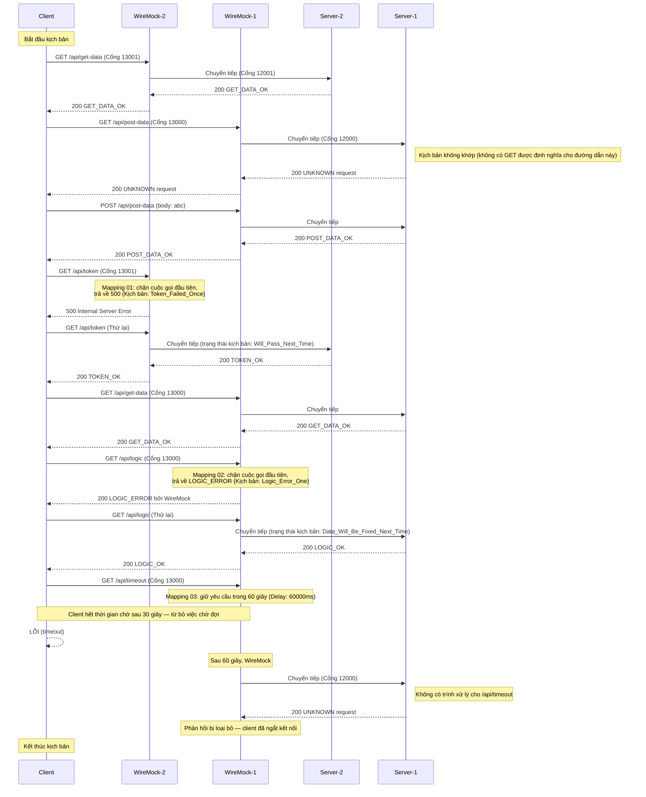

[English](README.md) | [Tiếng Việt](README.vi.md) | [日本語](README.ja.md)

# Client truy cập hai server thông qua WireMock

## Tổng quan

Trong bài test này, client kết nối với **hai server riêng biệt** thông qua **hai thực thể WireMock**, mỗi thực thể chạy trên một cổng khác nhau. Định tuyến được chia theo mục đích:

* Các yêu cầu đến `/api/token` và `/api/get-data` trên **cổng 13001** được xử lý bởi **WireMock #2**, thực thể này sẽ chuyển tiếp đến **Server #2** (cổng 12001).
* Tất cả các yêu cầu `/api/*` khác trên **cổng 13000** được xử lý bởi **WireMock #1**, thực thể này sẽ chuyển tiếp đến **Server #1** (cổng 12000).

Mô phỏng lỗi được áp dụng:
* Cuộc gọi đầu tiên đến `/api/token` (cổng 13001) trả về HTTP 500.
* Cuộc gọi đầu tiên đến `/api/logic` (cổng 13000) trả về HTTP 200 với thân lỗi logic.
* Cuộc gọi đến `/api/timeout` (cổng 13000) gây ra lỗi timeout phía client.



## Các kịch bản Server

**Server #1** (`scenario-server.csv`) — xử lý các định tuyến API chung:

| method | request        | response     |
| ------ | -------------- | ------------ |
| GET    | /api/get-data  | GET_DATA_OK  |
| POST   | /api/post-data | POST_DATA_OK |
| GET    | /api/logic     | LOGIC_OK     |

**Server #2** (`scenario-server-token.csv`) — xử lý token và các định tuyến get-data:

| method | request       | response    |
| ------ | ------------- | ----------- |
| GET    | /api/get-data | GET_DATA_OK |
| GET    | /api/token    | TOKEN_OK    |

## Hành động kiểm tra

* **Khởi chạy WireMock #1**
  Đi tới thư mục `tests\04_TwoServers\wm1` và chạy:
  ```powershell
  dotnet-wiremock --urls "http://localhost:13000" --ReadStaticMappings true --WireMockLogger WireMockConsoleLogger
  ```

* **Khởi chạy WireMock #2**
  Đi tới thư mục `tests\04_TwoServers\wm2` và chạy:
  ```powershell
  dotnet-wiremock --urls "http://localhost:13001" --ReadStaticMappings true --WireMockLogger WireMockConsoleLogger
  ```

* **Khởi chạy Server #1**
  Đi tới thư mục `tests\04_TwoServers` và chạy:
  ```powershell
  ..\..\server\server.ps1 .\scenario-server.csv http://localhost:12000 3
  ```

* **Khởi chạy Server #2**
  Đi tới thư mục `tests\04_TwoServers` và chạy:
  ```powershell
  ..\..\server\server.ps1 .\scenario-server-token.csv http://localhost:12001 3
  ```

* **Khởi chạy client**
  Đi tới thư mục `tests\04_TwoServers` và chạy:
  ```powershell
  ..\..\client\client.ps1 .\scenario-client.csv
  ```

* **Dừng các server**
  Sau khi tất cả các yêu cầu của client đã được gửi, nhấn **Ctrl+C** trên cả hai terminal của server để dừng.

## Mô tả luồng yêu cầu


