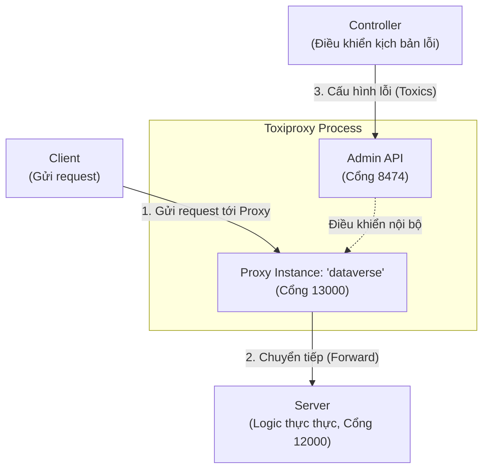

# Toxiproxy Binary

Thư mục này chứa binary của [Toxiproxy](https://github.com/Shopify/toxiproxy), một framework dùng để mô phỏng các điều kiện mạng lỗi (network failure) và độ trễ (latency).

## 📊 Mô hình kết nối (Network Topology)

Dưới đây là mô hình kết nối giữa các thành phần trong hệ thống lab này, bao gồm các cổng (port) mặc định:



## 🔌 Chi tiết các cổng (Port Mapping)

| Thành phần | Cổng | Mô tả |
| :--- | :--- | :--- |
| **Server** | `12000` | Cổng của server thật (upstream). `server.ps1` lắng nghe tại đây. |
| **Toxiproxy Proxy** | `13000` | Điểm truy cập cho Client. Mọi request đi qua đây sẽ bị controller gây lỗi. |
| **Toxiproxy Admin** | `8474` | Cổng quản lý của Toxiproxy. Controller dùng cổng này để bật/tắt lỗi. |

## 🚀 Cách khởi động nhanh

1. **Chạy Toxiproxy:**
   ```powershell
   .\toxiproxy-server-windows-amd64.exe
   ```

2. **Tạo Proxy Instance (Mapping 13000 -> 12000):**
   Chạy lệnh này trong PowerShell để khởi tạo proxy:
   ```powershell
   Invoke-RestMethod -Method Post -Uri "http://127.0.0.1:8474/proxies" -ContentType "application/json" -Body (@{
       name = "dataverse"
       listen = "127.0.0.1:13000"
       upstream = "127.0.0.1:12000"
   } | ConvertTo-Json)
   ```
