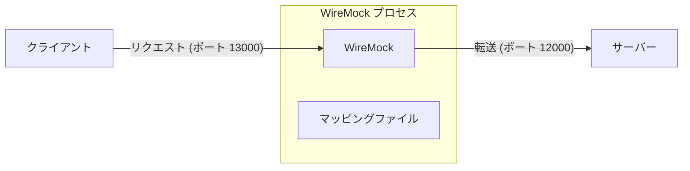

[English](README.md) | [Tiếng Việt](README.vi.md) | [日本語](README.ja.md)

# WireMock の使用方法

## 概要

**WireMock** は HTTP サーバーのシミュレーションツールであり、通常、クライアントと実際のサーバーの間に配置される **プロキシレイヤー (proxy layer)** として使用されます。クライアントがサーバーを直接呼び出す代わりに、すべてのリクエストはまず WireMock を通過します。そこで動作を **注入 (inject)** して、クライアントに返されるレスポンスを変更できます。この例では、WireMock は具体的に **エラーシナリオ**（500 エラー、ビジネスロジックエラー、タイムアウト）を **シミュレート** するために使用され、クライアントのエラー処理と再試行ロジック (retry logic) をテストします。

これらの注入は、**マッピングファイル (mapping files)**（**スタブ (stubs)**、**スタブマッピング (stub mappings)**、または **モック定義 (mock definitions)** とも呼ばれます）を介して定義されます。これらは WireMock の作業ディレクトリ内の `__admin/mappings/` ディレクトリに配置された JSON ファイルです。起動時に、WireMock はこれらのファイルをすべて自動的に読み込み、リクエストインターセプター (request interceptors) として適用します。



## インストール

WireMock.Net をインストールする方法はいくつかあります。以下は、グールバルツールとしてインストールする手順です。

* まず、.NET SDK がインストールされていない場合はインストールします：
    ```powershell
    winget install Microsoft.DotNet.SDK.8
    ```
* 新しい PowerShell ウィンドウを開き、WireMock.Net をインストールします：
    ```powershell
    dotnet nuget add source https://api.nuget.org/v3/index.json -n nuget.org
    dotnet tool install --global dotnet-wiremock
    ```
* インストール後、以下を実行します：
    ```
    dotnet-wiremock --urls "http://localhost:13000" --ReadStaticMappings true --WireMockLogger WireMockConsoleLogger
    ```

## マッピングファイル (Mapping Files)

WireMock には、**シナリオ (Scenarios - 状態を持つ動作)** と呼ばれる強力な機能があります。

WireMock は **状態マシン (State Machine)** を正確にシミュレートします。次のようなルールを定義できます：*"状態 1 のときにリクエストが来たら、500 エラーを返し、状態 2 に遷移する。状態 2 のときは、リクエストをそのまま通過させる。"*

これらのルール（マッピング）は JSON ファイルで定義されます。これらを構成するには、WireMock の作業ディレクトリ内に `__admin/mappings/` という名前のフォルダを作成し、そこに JSON ファイルを配置します。WireMock は起動時にこれらを自動的に読み込みます。

以下は設定ファイルの例です：

### 1. デフォルトプロキシ (フォールバック — `*` ですべてに一致)

このファイルは、キャッチオール（すべてを受け取る）として機能します。リクエストが特定のシナリオやエラーリミットに一致しない場合、自動的に実際のサーバー（Dataverse またはバックエンド）に転送されます。

*参照ファイル:* [00_default_proxy.json](__admin/mappings/00_default_proxy.json)
```json
{
  "Priority": 99,
  "Request": {
    "Path": {
      "Matchers": [
        {
          "Name": "WildcardMatcher",
          "Pattern": "/*"
        }
      ]
    }
  },
  "Response": {
    "ProxyUrl": "http://localhost:12000"
  }
}
```
*注意: `Priority = 99` は最低優先度を意味し、他のルールによってインターセプトされなかったリクエストのみをキャッチします。*

### 2. 500 エラーのシミュレート（1回のみ、その後は通過）

`/api/token` への最初の呼び出しは 500 エラーを返し、再試行は成功します。

*参照ファイル:* [01_500_on_token.json](__admin/mappings/01_500_on_token.json)
```json
{
  "Priority": 1,
  "Scenario": "Token_Failed_Once_Scenario",
  "SetStateTo": "Will_Pass_Next_Time",
  "Request": {
    "Methods": [
      "GET"
    ],
    "Path": {
      "Matchers": [
        {
          "Name": "WildcardMatcher",
          "Pattern": "/api/token"
        }
      ]
    }
  },
  "Response": {
    "StatusCode": 500,
    "BodyAsJson": {
      "error": "Internal Server Error",
      "message": "Simulated error by WireMock."
    }
  }
}
```

**仕組み:**
* シナリオは常に `"Started"` 状態から始まります。
* `/api/token` への最初の呼び出しで、このマッピングが一致し、`500` エラーを返し、シナリオを `"Will_Pass_Next_Time"` に遷移させます。
* 次の再試行時、現在の状態は `"Will_Pass_Next_Time"` なので、このマッピングは一致しなくなります。リクエストはデフォルトプロキシに送られ、実際のサーバーに到達します（成功）。

### 3. ビジネスロジックエラーのシミュレーション (HTTP 200 で不正なデータを返す)

これはサイレントな失敗です。ネットワークは正常で、サーバーは OK を返しますが、レスポンスデータが不正です。

*参照ファイル:* [02_logic_error.json](__admin/mappings/02_logic_error.json)

```json
{
  "Priority": 2,
  "Scenario": "Logic_Error_One_Scenario",
  "SetStateTo": "Data_Will_Be_Fixed_Next_Time",
  "Request": {
    "Path": {
      "Matchers": [
        {
          "Name": "WildcardMatcher",
          "Pattern": "/api/logic"
        }
      ]
    }
  },
  "Response": {
    "StatusCode": 200,
    "Body": "LOGIC_ERROR by WireMock"
  }
}
```
*同じ仕組みです：HTTP 200 で不正なデータを一度注入し、状態を反転させ、再試行時に通過させます。*

### 4. タイムアウトのシミュレーション

応答しないハングしたサーバーをシミュレートします。`Delay` パラメータ（ミリ秒単位）を使用します。

*参照ファイル:* [03_timeout.json](__admin/mappings/03_timeout.json)

```json
{
  "Priority": 3,
  "Scenario": "Timeout_Scenario",
  "Request": {
    "Path": {
      "Matchers": [
        {
          "Name": "WildcardMatcher",
          "Pattern": "/api/timeout"
        }
      ]
    }
  },
  "Response": {
    "StatusCode": 200,
    "ProxyUrl": "http://localhost:12000",
    "Delay": 60000
  }
}
```
**仕組み:** WireMock はリクエストを受け付けますが、サーバーに転送する前に **レスポンスを 60 秒間（60,000 ミリ秒）保持します**。クライアントは、接続タイムアウトを超過したため、この待機中にタイムアウトします。
