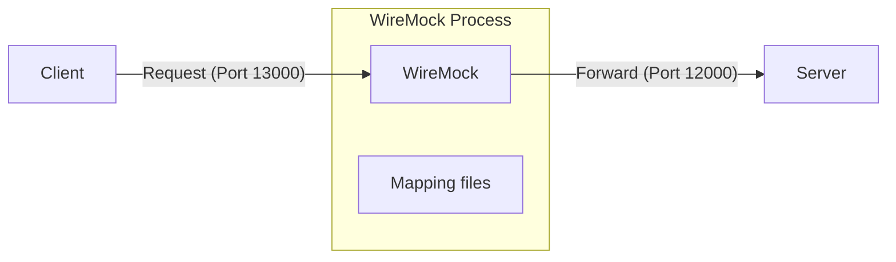

[English](README.md) | [Tiếng Việt](README.vi.md) | [日本語](README.ja.md)

# Using WireMock

## Overview

**WireMock** is an HTTP server simulation tool, typically used as a **proxy layer** sitting between the client and the real server. Instead of the client calling the server directly, all requests pass through WireMock first — where you can **inject** behavior to alter the response returned to the client. In this example, WireMock is used specifically to **simulate error scenarios** (500 errors, business logic errors, timeouts) to test the client's error handling and retry logic.

These injections are defined via **mapping files** (also called **stubs**, **stub mappings**, or **mock definitions**) — JSON files placed in the `__admin/mappings/` directory inside WireMock's working directory. On startup, WireMock automatically loads all these files and applies them as request interceptors.



## Install

There are several ways to install WireMock.Net. Below are the steps to install it as a global tool.

* First, install .NET SDK if not already installed:
    ```powershell
    winget install Microsoft.DotNet.SDK.8
    ```
* Open a new PowerShell window, then install WireMock.Net:
    ```powershell
    dotnet nuget add source https://api.nuget.org/v3/index.json -n nuget.org
    dotnet tool install --global dotnet-wiremock
    ```
* After installation, run:
    ```
    dotnet-wiremock --urls "http://localhost:13000" --ReadStaticMappings true --WireMockLogger WireMockConsoleLogger
    ```

## Mapping Files

WireMock has a powerful feature called **Scenarios (Stateful Behaviour)**.

WireMock accurately simulates a **State Machine**. It lets you define rules like: *"When in State 1, if a request comes in, return a 500 error and transition to State 2. When in State 2, let the request pass through."*

These rules (mappings) are defined in JSON files. To configure them, create a folder named `__admin/mappings/` inside WireMock's working directory and place your JSON files there. WireMock will automatically load them on startup.

Below are example configuration files:

### 1. Default Proxy (Fallback — matches everything with `*`)

This file acts as a catch-all. If a request doesn't match any specific scenario or error rule, it is automatically forwarded to the real server (Dataverse or backend).

*Reference file:* [00_default_proxy.json](__admin/mappings/00_default_proxy.json)
```json
{
  "Priority": 99,
  "Request": {
    "Path": {
      "Matchers": [
        {
          "Name": "WildcardMatcher",
          "Pattern": "/*"
        }
      ]
    }
  },
  "Response": {
    "ProxyUrl": "http://localhost:12000"
  }
}
```
*Note: `Priority = 99` means lowest priority — it only catches requests not intercepted by any other rule.*

### 2. Simulate a 500 Error (Once, Then Pass)

The first call to `/api/token` returns a 500 error; the retry succeeds.

*Reference file:* [01_500_on_token.json](__admin/mappings/01_500_on_token.json)
```json
{
  "Priority": 1,
  "Scenario": "Token_Failed_Once_Scenario",
  "SetStateTo": "Will_Pass_Next_Time",
  "Request": {
    "Methods": [
      "GET"
    ],
    "Path": {
      "Matchers": [
        {
          "Name": "WildcardMatcher",
          "Pattern": "/api/token"
        }
      ]
    }
  },
  "Response": {
    "StatusCode": 500,
    "BodyAsJson": {
      "error": "Internal Server Error",
      "message": "Simulated error by WireMock."
    }
  }
}
```

**How it works:**
* The scenario always starts in the `"Started"` state.
* On the first call to `/api/token`, this mapping matches, returns a `500` error, and transitions the scenario to `"Will_Pass_Next_Time"`.
* On the next retry, the current state is `"Will_Pass_Next_Time"`, so this mapping no longer matches. The request falls through to the Default Proxy and reaches the real server (success).

### 3. Simulate a Business Logic Error (HTTP 200 with bad data)

This is a silent failure: the network is fine, the server says OK, but the response data is garbage.

*Reference file:* [02_logic_error.json](__admin/mappings/02_logic_error.json)

```json
{
  "Priority": 2,
  "Scenario": "Logic_Error_One_Scenario",
  "SetStateTo": "Data_Will_Be_Fixed_Next_Time",
  "Request": {
    "Path": {
      "Matchers": [
        {
          "Name": "WildcardMatcher",
          "Pattern": "/api/logic"
        }
      ]
    }
  },
  "Response": {
    "StatusCode": 200,
    "Body": "LOGIC_ERROR by WireMock"
  }
}
```
*Same mechanism: injects bad data once with HTTP 200, flips the state, then passes through on retry.*

### 4. Simulate a Timeout

Simulates a hanging server that never responds. Uses the `Delay` parameter (in milliseconds).

*Reference file:* [03_timeout.json](__admin/mappings/03_timeout.json)

```json
{
  "Priority": 3,
  "Scenario": "Timeout_Scenario",
  "Request": {
    "Path": {
      "Matchers": [
        {
          "Name": "WildcardMatcher",
          "Pattern": "/api/timeout"
        }
      ]
    }
  },
  "Response": {
    "StatusCode": 200,
    "ProxyUrl": "http://localhost:12000",
    "Delay": 60000
  }
}
```
**How it works:** WireMock accepts the request but **holds the response for 60 seconds (60,000 ms)** before forwarding it to the server. The client times out during this wait due to an exceeded connection timeout.
