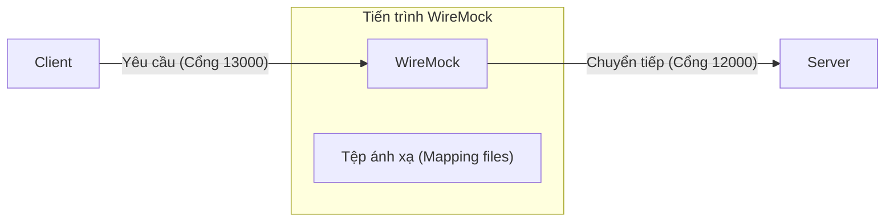

[English](README.md) | [Tiếng Việt](README.vi.md) | [日本語](README.ja.md)

# Sử dụng WireMock

## Tổng quan

**WireMock** là một công cụ mô phỏng HTTP server, thường được sử dụng như một **lớp proxy (proxy layer)** nằm giữa client và server thật. Thay vì client gọi trực tiếp đến server, tất cả các yêu cầu sẽ đi qua WireMock trước — nơi bạn có thể **tiêm (inject)** các hành vi để thay đổi phản hồi trả về cho client. Trong ví dụ này, WireMock được sử dụng cụ thể để **mô phỏng các kịch bản lỗi** (lỗi 500, lỗi logic nghiệp vụ, timeout) để kiểm tra khả năng xử lý lỗi và logic thử lại (retry logic) của client.

Các lệnh "tiêm" này được định nghĩa thông qua các **tệp cấu hình ánh xạ (mapping files)** (còn được gọi là **stubs**, **stub mappings**, hoặc **mock definitions**) — là các tệp JSON được đặt trong thư mục `__admin/mappings/` bên trong thư mục làm việc của WireMock. Khi khởi động, WireMock sẽ tự động tải tất cả các tệp này và áp dụng chúng như các bộ chặn yêu cầu (request interceptors).



## Cài đặt

Có nhiều cách để cài đặt WireMock.Net. Dưới đây là các bước để cài đặt nó như một công cụ toàn cục (global tool).

* Đầu tiên, cài đặt .NET SDK nếu chưa được cài đặt:
    ```powershell
    winget install Microsoft.DotNet.SDK.8
    ```
* Mở một cửa sổ PowerShell mới, sau đó cài đặt WireMock.Net:
    ```powershell
    dotnet nuget add source https://api.nuget.org/v3/index.json -n nuget.org
    dotnet tool install --global dotnet-wiremock
    ```
* Sau khi cài đặt, chạy lệnh:
    ```
    dotnet-wiremock --urls "http://localhost:13000" --ReadStaticMappings true --WireMockLogger WireMockConsoleLogger
    ```

## Tệp ánh xạ (Mapping Files)

WireMock có một tính năng mạnh mẽ được gọi là **Scenarios (Stateful Behaviour)**.

WireMock mô phỏng chính xác một **Máy trạng thái (State Machine)**. Nó cho phép bạn định nghĩa các quy tắc như: *"Khi ở Trạng thái 1, nếu có yêu cầu đến, hãy trả về lỗi 500 và chuyển sang Trạng thái 2. Khi ở Trạng thái 2, hãy cho phép yêu cầu đi qua bình thường."*

Các quy tắc (ánh xạ) này được định nghĩa trong các tệp JSON. Để cấu hình chúng, hãy tạo một thư mục có tên `__admin/mappings/` bên trong thư mục làm việc của WireMock và đặt các tệp JSON của bạn vào đó. WireMock sẽ tự động tải chúng khi khởi động.

Dưới đây là các tệp cấu hình ví dụ:

### 1. Proxy mặc định (Dự phòng — khớp với mọi thứ bằng `*`)

Tệp này đóng vai trò như một bộ lọc "catch-all". Nếu một yêu cầu không khớp với bất kỳ kịch bản hoặc quy tắc lỗi cụ thể nào, nó sẽ tự động được chuyển tiếp đến server thực (Dataverse hoặc backend).

*Tệp tham chiếu:* [00_default_proxy.json](__admin/mappings/00_default_proxy.json)
```json
{
  "Priority": 99,
  "Request": {
    "Path": {
      "Matchers": [
        {
          "Name": "WildcardMatcher",
          "Pattern": "/*"
        }
      ]
    }
  },
  "Response": {
    "ProxyUrl": "http://localhost:12000"
  }
}
```
*Lưu ý: `Priority = 99` nghĩa là mức ưu tiên thấp nhất — nó chỉ bắt các yêu cầu không bị chặn bởi bất kỳ quy tắc nào khác.*

### 2. Mô phỏng lỗi 500 (Một lần, sau đó cho qua)

Cuộc gọi đầu tiên đến `/api/token` trả về lỗi 500; lần thử lại sau đó sẽ thành công.

*Tệp tham chiếu:* [01_500_on_token.json](__admin/mappings/01_500_on_token.json)
```json
{
  "Priority": 1,
  "Scenario": "Token_Failed_Once_Scenario",
  "SetStateTo": "Will_Pass_Next_Time",
  "Request": {
    "Methods": [
      "GET"
    ],
    "Path": {
      "Matchers": [
        {
          "Name": "WildcardMatcher",
          "Pattern": "/api/token"
        }
      ]
    }
  },
  "Response": {
    "StatusCode": 500,
    "BodyAsJson": {
      "error": "Internal Server Error",
      "message": "Simulated error by WireMock."
    }
  }
}
```

**Cách thức hoạt động:**
* Kịch bản luôn bắt đầu ở trạng thái `"Started"`.
* Trong lần gọi đầu tiên đến `/api/token`, ánh xạ này khớp, trả về lỗi `500`, và chuyển trạng thái kịch bản sang `"Will_Pass_Next_Time"`.
* Ở lần thử lại tiếp theo, trạng thái hiện tại là `"Will_Pass_Next_Time"`, vì vậy ánh xạ này không còn khớp nữa. Yêu cầu sẽ rơi xuống Proxy mặc định và đi đến server thực (thành công).

### 3. Mô phỏng lỗi logic nghiệp vụ (HTTP 200 với dữ liệu sai)

Đây là một lỗi âm thầm: mạng ổn định, server phản hồi OK, nhưng dữ liệu phản hồi là rác.

*Tệp tham chiếu:* [02_logic_error.json](__admin/mappings/02_logic_error.json)

```json
{
  "Priority": 2,
  "Scenario": "Logic_Error_One_Scenario",
  "SetStateTo": "Data_Will_Be_Fixed_Next_Time",
  "Request": {
    "Path": {
      "Matchers": [
        {
          "Name": "WildcardMatcher",
          "Pattern": "/api/logic"
        }
      ]
    }
  },
  "Response": {
    "StatusCode": 200,
    "Body": "LOGIC_ERROR by WireMock"
  }
}
```
*Cơ chế tương tự: tiêm dữ liệu sai một lần với HTTP 200, lật trạng thái, sau đó cho qua ở lần thử lại.*

### 4. Mô phỏng Timeout

Mô phỏng một server bị treo và không bao giờ phản hồi. Sử dụng tham số `Delay` (tính bằng mili giây).

*Tệp tham chiếu:* [03_timeout.json](__admin/mappings/03_timeout.json)

```json
{
  "Priority": 3,
  "Scenario": "Timeout_Scenario",
  "Request": {
    "Path": {
      "Matchers": [
        {
          "Name": "WildcardMatcher",
          "Pattern": "/api/timeout"
        }
      ]
    }
  },
  "Response": {
    "StatusCode": 200,
    "ProxyUrl": "http://localhost:12000",
    "Delay": 60000
  }
}
```
**Cách thức hoạt động:** WireMock chấp nhận yêu cầu nhưng **giữ phản hồi trong 60 giây (60.000 ms)** trước khi chuyển tiếp nó đến server. Client sẽ bị quá thời gian chờ (timeout) trong khi chờ đợi do vượt quá thời gian chờ kết nối đã thiết lập.
